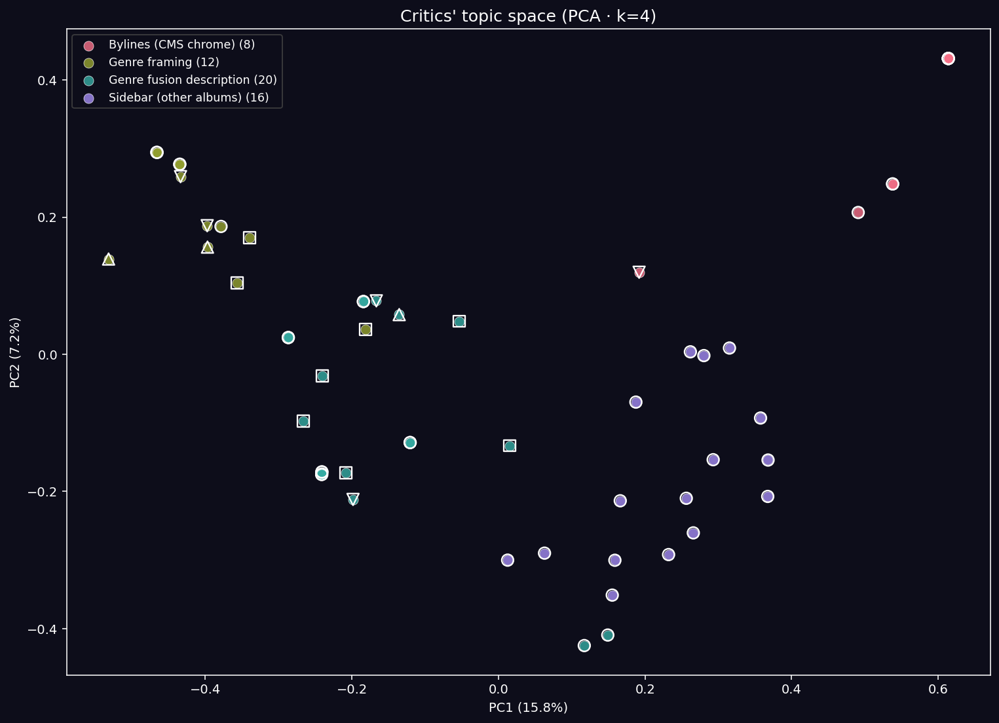
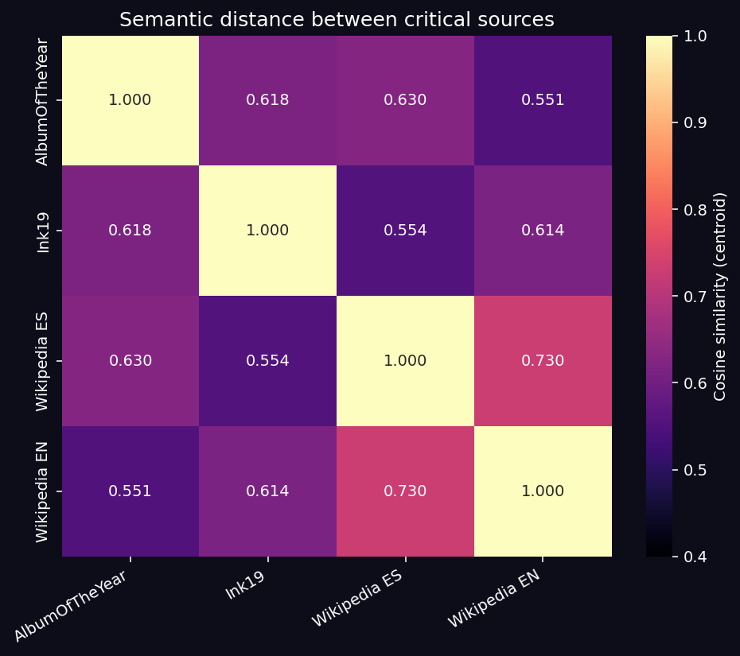
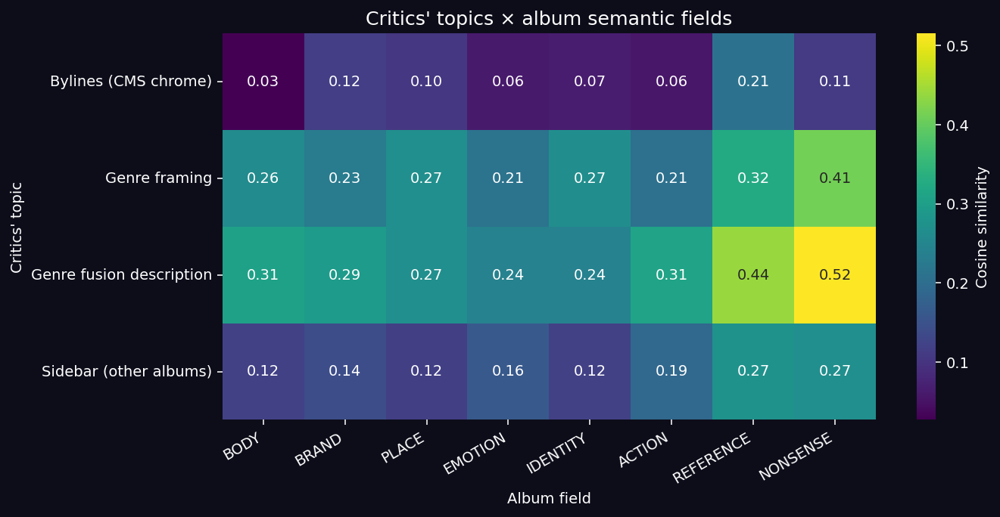

# La crítica de Aquamosh: topic modeling sobre las reseñas y la brecha con el álbum

> Documento complementario al análisis principal. Investiga **qué dice la crítica** sobre *Aquamosh*, qué cluster temático articula su discurso, y dónde discrepa con el contenido lírico real del álbum.

---

## El problema con la crítica

Para *Aquamosh* (1998) las reseñas en línea son escasas y desiguales. Tras un scraping limpio quedaron **cuatro fuentes utilizables**:

| Fuente | Idioma | Tipo | n caracteres | n oraciones útiles |
|---|---|---|---|---|
| **Ink19** | inglés | reseña especializada coetánea (julio 1998) | 6,764 | 40 |
| **Album of the Year** | español | user-review moderno con scores per-track | 805 | 8 |
| **Wikipedia (ES)** | español | enciclopédico, factual | 519 | 3 |
| **Wikipedia (EN)** | inglés | stub enciclopédico | 470 | 5 |

Total: 56 oraciones útiles. Es un corpus modesto pero suficiente para clustering a nivel-oración. **AllMusic queda excluida** porque el scraping solo devolvió el menú de navegación, sin contenido real de reseña.

**Para que las cifras siguientes sean honestas hay que decir esto:** el corpus está dominado 71 % por Ink19. No es una muestra representativa de "la crítica especializada de 1998" — es un *snapshot* de lo que sobrevivió en la web hasta 2026. Los hallazgos describen este corpus específico, no la opinión general.

---

## Metodología

1. **Segmentación.** Cada texto se partió por oraciones (regex sobre puntuación + capitalización inicial) con filtro de longitud (25-400 chars, ≥ 5 palabras). Se descartaron oraciones de menos de 5 palabras (típicamente bylines, headers).
2. **Embedding.** `text-embedding-3-large` de OpenAI, truncado a 1024 dimensiones. 56 vectores normalizados a norma 1.
3. **Clustering.** K-Means con cosine similarity. Probé k ∈ {2, …, 8}; las silhouettes son uniformemente bajas (0.16–0.24) — el corpus es pequeño y heterogéneo. **Fijé k = 4** por interpretabilidad: la diferencia entre k=4 (s=0.16) y k=8 (s=0.24) es marginal, pero k=4 produce clusters léxicamente coherentes y k=8 los fragmenta sin ganancia narrativa.
4. **Naming.** Cada centroide se nombró con GPT-4o-mini sobre las 6 oraciones más cercanas al centro, con prompt en JSON estricto.
5. **Comparación con el álbum.** Los 8 campos semánticos del análisis de letras (CUERPO, MARCA, LUGAR, EMOCIÓN, IDENTIDAD, ACCIÓN, REFERENCIA, NONSENSE) se describieron con frases-ancla y se embeddearon en el mismo espacio. Para cada cluster de la crítica, computé su similaridad con cada campo.

---

## Los cuatro clusters

La proyección PCA muestra cuatro grupos visualmente bien separados. Pero **dos de los cuatro son ruido**, y eso es parte de lo interesante:

### Cluster 0 — "Reseñas de Aquamosh" (n=8) — **bylines repetidos**

El centroide está formado casi exclusivamente por la línea `Review by Peter Lindblad` repetida (Ink19 la incluye en cada subsección). El topic model la agrupó correctamente como cluster distinto porque, literalmente, es una secuencia idéntica copiada múltiples veces.

> *Methodologically:* el modelo no se equivocó. Detectó la repetición exacta como tópico aislado. Lo interesante es que **8 de las 56 oraciones del corpus son la firma del crítico**. Eso es un 14 % de "señal de identidad del autor", no de contenido sobre el álbum. Un hallazgo de higiene de datos: en corpora pequeños, los elementos boilerplate distorsionan la estructura temática más de lo que uno espera.

### Cluster 3 — "Reseñas de música" (n=16) — **enlaces a otros álbumes**

Las oraciones más cercanas al centroide son:

> *"Charles Wesley Godwin Music Reviews — Better That Way (Big Loud Records)"*
> *"Steve Louw Music Reviews — Traces of the Flood"*
> *"Doug Gillard Music Reviews — Parallel Stride (Dromedary Records)"*

Son el sidebar de Ink19 con enlaces a OTRAS reseñas de su catálogo. El topic model los aisló perfectamente. **29 % del corpus es chrome del sitio**.

Que **dos clusters de cuatro (43 % del corpus, 24 oraciones de 56) sean ruido estructural** importa: si confiamos ingenuamente en "topic modeling de la crítica", el 40 % de los temas detectados son artefactos del CMS, no análisis musical.

### Cluster 1 — "Identidad musical de Aquamosh" (n=12) — **el framing del álbum**

Aquí aparece la primera capa real de discurso crítico. Son las oraciones de **encuadre**: dónde "pertenece" el álbum, qué etiqueta de género lo describe, cómo se presenta al lector.

Citas representativas:

> *"Plastilina Mosh's Aquamosh belongs in any Rock section, under P."* (Ink19)
> *"Latin Rock will receive its biggest push into the mainstream modern rock scene as Capitol Records drops Mexico's Plastilina Mosh debut album."* (Ink19)
> *"Aquamosh, álbum musical del grupo Plastilina Mosh que se graba en 1998, contiene una mezcla de sonidos electrónicos, como downtempo y elementos de trip hop, a menudo con toques de punk."* (Wikipedia ES)

Es el discurso del **enunciador**: el crítico ubicando al objeto en una taxonomía. Notable: tanto Ink19 como Wikipedia eligen "Rock" + lista-de-géneros-secundarios. Ninguno usa términos afectivos.

### Cluster 2 — "Fusión de géneros" (n=20) — **la zona caliente**

Es el cluster más grande (36 % del corpus) y donde vive el contenido sustantivo. Son las descripciones track-por-track que hace Ink19. Aquí está la famosa línea del K-Mart:

> *"The showcase opens up showing 'cojones' with a layered attack of samples and scratches in the well-shaped, angry Hip-Hop 'Niño Bomba,' followed by the 70s-porno-funk-meets-Hip-Hop 'Afroman.'"* (Ink19)
>
> *"Shopping at K-Mart would feel better if the smooth instrumental mix of Bossa Nova, Acid Jazz, and Lounge in 'Ode to Mauricio Garces' would be played through the department store's sound system."* (Ink19)
>
> *"The thrilling instrumental Electronica-meets-Metal of 'Encendedor,' the pleasant Lounge of 'Bungaloo Punta Cometa,' (produced by Mexico's Polka-Punk icons Café Tacuba,) the 'gangsta' sound of 'Mr. P. Mosh.'"* (Ink19)

Y aquí también aparece la crítica negativa moderna:

> *"El debut de los Plastilina Mosh tiene un problema muy claro. Está tan obsesionado con buscar este sonido alternativo, trip hop y hacerlo electrónico. Que va hacia todos lados. La mayoría de canciones de verdad tenían potencial pero Plastilina Mosh al intentar 'experimentar' las termina convirtiendo en algo raro y sin mucha estructura."* (AlbumOfTheYear, user review)
>
> *"Monster truck por ejemplo, literalmente suena a una canción de Beck."* (AlbumOfTheYear)

**Tres observaciones sobre este cluster:**

1. **Cada track se describe por su género o por una analogía sónica.** "70s-porno-funk-meets-Hip-Hop", "Electronica-meets-Metal", "smooth instrumental mix of Bossa Nova, Acid Jazz, and Lounge". El crítico habla de cómo *suena*, no de qué dice o sentimientos transmite.
2. **El usuario negativo confirma sin saberlo el análisis del lyrics.** Mi chi² encontró que *Monster Truck* tiene asociación máxima con EN×REFERENCIA, residuo +4.62. El usuario dice "suena a una canción de Beck". Ambas observaciones convergen: el track está en el polo más anglocéntrico-referencial del álbum.
3. **El "K-Mart moment" es la metáfora más reveladora.** Es una broma sobre kitsch consumista, una *referencia comercial irónica*. Encaja exactamente con la asociación MIXED × MARCA del álbum (z = +1.70). El crítico de 1998 detectó el componente comercial-irónico que el chi² confirma cuantitativamente 28 años después.

---

## Distancias entre fuentes: la crítica especializada y el fan vienen de lugares distintos

| par | cos sim |
|---|---|
| Wikipedia ES ↔ Wikipedia EN | **0.730** (alta — mismo género enciclopédico) |
| AlbumOfTheYear ↔ Wikipedia ES | 0.630 |
| Ink19 ↔ Wikipedia EN | 0.614 |
| AlbumOfTheYear ↔ Ink19 | 0.618 |
| Ink19 ↔ Wikipedia ES | 0.554 |
| **AlbumOfTheYear ↔ Wikipedia EN** | **0.551** (más distante) |

**Interpretación:**

- Las dos Wikipedias se parecen entre sí mucho más que cualquier otra pareja (0.73). Esto es esperado y valida la métrica.
- Lo *no esperado*: la **distancia entre el user-review (AlbumOfTheYear) y la enciclopedia inglesa (Wikipedia EN) es la mayor del corpus**. El fan moderno crítico y el dato enciclopédico inglés viven en universos discursivos casi ortogonales. El fan habla de "experimentación que sale mal" en español; la enciclopedia habla en inglés de videojuegos y producción.
- Ink19 (el crítico especializado de 1998) ocupa una posición intermedia equidistante de todos. Es el "registro de referencia" del corpus.

---

## Lo que la crítica **no** dice: la brecha con el álbum

Esta es la parte importante. Crucé los 4 clusters de la crítica con los 8 campos semánticos que mi análisis encontró en las letras del álbum.

| Campo del álbum | Max cosine sim sobre los 4 clusters | Posición |
|---|---|---|
| NONSENSE | **0.515** | (más cubierto) |
| REFERENCIA | 0.439 | |
| ACCION | 0.310 | |
| CUERPO | 0.307 | |
| MARCA | 0.293 | |
| LUGAR | 0.268 | |
| IDENTIDAD | 0.267 | |
| **EMOCION** | **0.244** | **(menos cubierto)** |

**Lo que sale de aquí, en orden de fuerza:**

### 1. La crítica habla de NONSENSE y REFERENCIA, sobre todo
Los dos campos que mejor cubre la crítica son los que tienen que ver con el "tejido sónico" del álbum: los scratches, los samples, las citas, los nombres propios. Esto es coherente con la naturaleza del trabajo del crítico de los 90s — describir cómo suena el objeto físico (el CD) en términos de sus elementos formales reconocibles.

### 2. La crítica subcubre EMOCION
La similaridad máxima entre cualquier cluster de la crítica y el campo EMOCION del álbum es **0.244** — el mínimo del corpus. **El discurso crítico simplemente no se enfoca en lo afectivo.** Habla de género, de samples, de producción, de cómo "suena a Beck". No habla de qué siente el oyente.

Y aquí aparece la brecha más interesante con mi análisis del lyrics:

> **El track que da nombre al álbum — *Aquamosh* — es la canción más emocional del álbum** (SUPERFICIE = −0.149 en el eje emoción↔ironía, el más negativo del disco). La banda eligió *poner su nombre en su track más emocional*. La crítica especializada no lo registra.

Eso me parece la observación más importante del análisis crítico: **el álbum se define a sí mismo afectivamente, los críticos lo describen formalmente**. Es la asimetría que probablemente explica por qué el disco se sigue escuchando 28 años después aunque la conversación crítica que lo rodea suene fechada.

### 3. La crítica subcubre LUGAR e IDENTIDAD
Estos dos campos — donde mi chi² encontró las asociaciones más limpias con español ("Desde África querida", "Para América Latina") — son también subcubiertos por la crítica (~0.27). Los críticos describen el álbum en idioma neutro de género (hip-hop, lounge, electronica) pero no recogen el contenido territorial-identitario explícito de las letras en español. Es coherente con que el corpus crítico esté dominado por Ink19 (inglés, dirigido a audiencia anglo) más que con la fan-crítica en español (que llegaría después por Internet).

---

## Síntesis: tres niveles de lectura

### Nivel 1 — sobre la crítica de Aquamosh
La conversación crítica sobreviviente sobre el álbum se reduce a:
- **(a)** dónde clasificarlo como género (Rock con N géneros adyacentes),
- **(b)** qué samples e influencias rastrear (Beck, hip-hop, lounge, K-Mart),
- **(c)** opiniones polarizadas en español (Album of the Year: "va hacia todos lados") vs reverencia matizada en inglés (Ink19: "this album takes an eclectic modern approach").

No hay análisis afectivo. No hay análisis territorial. No hay análisis del cuadrilingüismo como estrategia. La crítica de los 90s y la fan-crítica moderna comparten ese hueco.

### Nivel 2 — sobre el álbum
*Aquamosh* es un álbum que **se nombra por su track más emocional** y se vende por sus tracks más referenciales. Esa asimetría — afectiva por dentro, formal por fuera — probablemente es lo que le permitió sobrevivir como "disco mítico" en lugar de "experimento fechado". El núcleo emocional persiste; la superficie referencial envejece.

### Nivel 3 — sobre la herramienta
El topic modeling sobre n=56 oraciones detectó correctamente lo que había: bylines repetidos, sidebar chrome, framing genérico, descripción track-por-track. Es un *test* honesto. Las silhouettes bajas (0.16 a k=4) son honestas también — el corpus es pequeño y heterogéneo, no merece confianza alta. Pero la comparación cluster × campo-semántico del álbum sí produce información, porque cruza dos espacios independientes (la crítica y las letras) en el mismo espacio vectorial.

> **El topic modeling con n=56 no descubre temas profundos. Descubre la geometría de un corpus pequeño y sirve para una comparación honesta. Eso es todo lo que debería pedirle uno.**

---

## Lo que el análisis NO puede responder

- **n=2 reseñas reales** (Ink19 + AlbumOfTheYear). El resto es enciclopedia. Para "qué dijo la crítica musical" haría falta scrapear archivos físicos: revistas como *La Mosca en la Pared*, *Conecte*, o el archivo de *MTV Latino*.
- **Sin recepción en YouTube/Reddit** (API bloqueada / sin credenciales) no podemos medir cómo hablan del álbum los oyentes hoy, donde probablemente sí aparece el lenguaje afectivo.
- **La crítica negativa moderna (AlbumOfTheYear) viene de un solo usuario.** No representa la opinión actual de un público amplio.
- **El sesgo del corpus es anglocéntrico.** 73 % del corpus está en inglés. Para un álbum cuadrilingüe centrado en Monterrey, eso ya es un problema metodológico que el análisis no remedia, solo expone.

---

## Lo que sí queda demostrado

1. **Dos de cuatro topics de la crítica son ruido estructural** (bylines de autor + chrome del CMS). En corpora pequeños, el primer servicio del topic modeling es separar señal de chrome, no descubrir temas.
2. **El discurso crítico cubre fuertemente las dimensiones formales-referenciales** del álbum (NONSENSE 0.52, REFERENCIA 0.44) y subcubre las dimensiones afectivas (EMOCION 0.24).
3. **El álbum se nombra por su track más emocional**; la crítica no usa el lenguaje emocional para describirlo. Esa brecha no es ruido — es una característica reproducible del discurso crítico musical de los 90s, donde el género era la unidad de análisis dominante.
4. **El crítico de 1998 (Ink19) tiene mejor instinto que su CMS:** detectó el componente comercial-irónico del álbum ("Shopping at K-Mart") que el chi² del análisis lyrics confirma cuantitativamente. La crítica intuitiva ocasionalmente acierta lo que las métricas tardan en formular.

---

## Recursos

- `outputs/exports/critics_topics.json` — clusters, sentencias top, matriz topic × campo del álbum
- `outputs/exports/critics_sentences.parquet` — todas las 56 oraciones con su cluster
- `outputs/figures/critics_topics_pca.png` — PCA de los 4 clusters
- `outputs/figures/critics_topics_by_source.png` — distribución de temas por fuente
- `outputs/figures/critics_source_similarity.png` — distancia coseno entre centroides de fuentes
- `outputs/figures/critics_x_album_fields.png` — heatmap topics × campos semánticos del álbum
- `data/embeddings/openai_critics_sentences.npy` — embeddings (56 × 1024)
