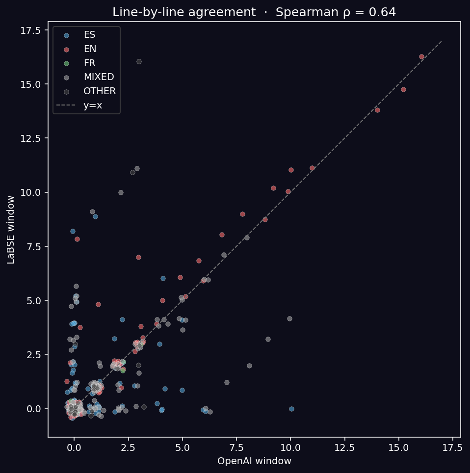
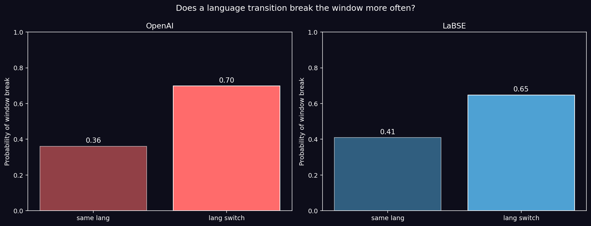
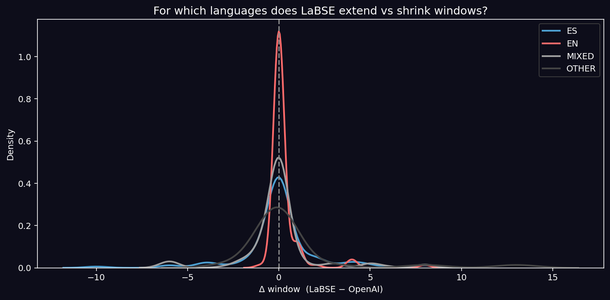
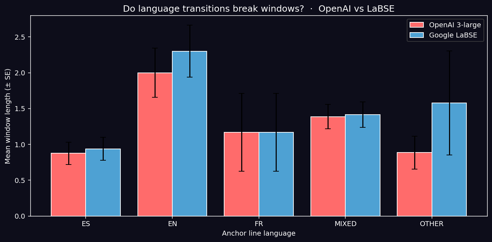
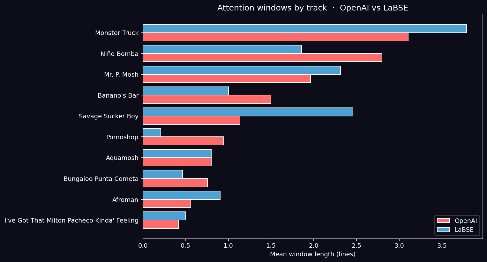
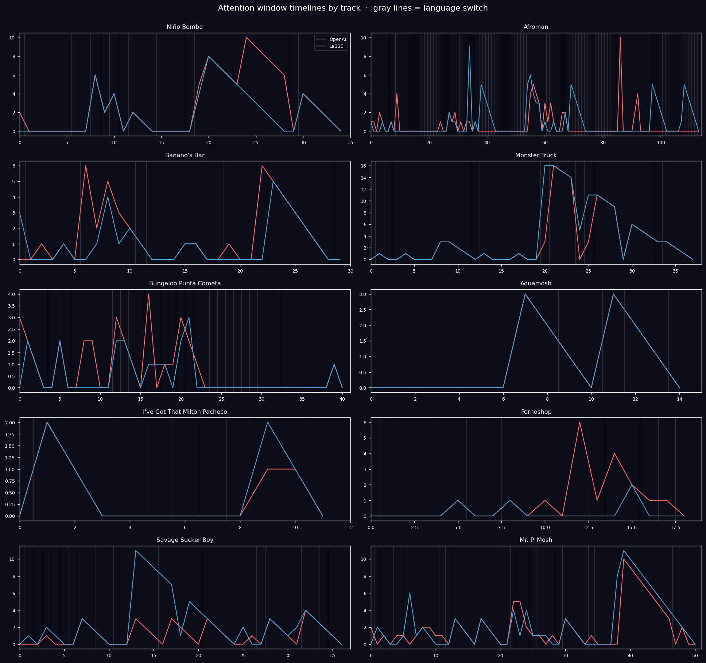

# Attention Windows en Aquamosh — OpenAI vs Google LaBSE

> Marco teórico, computación dual, interpretación y figuras generadas.
> Este documento es la base del próximo blog post.

---

## 1 · Por qué este análisis es interesante

El post anterior del blog (*Attention Windows: Measuring Narrative Cognitive Load in Beatles vs Pink Floyd*) estableció un hallazgo perturbador: los embeddings de transformers **no miden continuidad conceptual**; miden **continuidad léxica**. Los Beatles obtuvieron ventanas de atención más largas que Pink Floyd no porque hicieran un disco más coherente, sino porque su arquitectura verso-coro repite tokens, mientras que Pink Floyd reformula la misma idea con vocabulario distinto en cada track de *Dark Side of the Moon*.

Esa observación queda flotando. *Aquamosh* es el experimento natural perfecto para volverla testeable: **es un álbum cuadrilingüe**. Cada cambio de idioma es una discontinuidad léxica garantizada. Si los modelos de embedding miden superficie y no sentido, los cambios de idioma deberían disparar rupturas de ventana sistemáticamente — incluso cuando el tema continúa.

Esto convierte al álbum en un *probe* de la hipótesis distribucional.

---

## 2 · Marco teórico

### 2.1 — Definición operacional

Sea una canción una secuencia de líneas $L = \{l_1, l_2, \dots, l_n\}$. Un modelo de embeddings $\phi$ produce vectores $e_i = \phi(l_i) \in \mathbb{R}^d$.

La **ventana de atención** en la posición $i$ se define como:

$$W_i(\theta) = \max \left\{ k \; : \; \mathrm{sim}(e_i, e_{i+j}) \geq \theta \;\; \forall j \in [1, k] \right\}$$

donde $\mathrm{sim}(\cdot, \cdot)$ es coseno y $\theta$ es un umbral calibrado por modelo.

Operacionalmente, $W_i$ cuenta cuántas líneas consecutivas posteriores siguen estando *cerca* del ancla. Cuando $W_i = 0$, la línea siguiente ya cae por debajo del umbral y la ventana se rompe.

### 2.2 — Calibración del umbral

Comparar $W_i^{\text{OpenAI}}$ con $W_i^{\text{LaBSE}}$ con el mismo $\theta$ es ingenuo: los modelos tienen distribuciones de similaridad propias. OpenAI `text-embedding-3-large` y LaBSE viven en geometrías distintas (3072d vs 768d, decoder vs encoder, monolingüe-dominante vs entrenamiento paralelo).

Calibramos por modelo:

$$\theta_{\text{modelo}} = \mathrm{mediana}\{\mathrm{sim}(e_i, e_j)\}_{\text{pares aleatorios}} + \mathrm{SD}$$

Esto define $\theta$ como "una similaridad notablemente alta para este modelo". En nuestros datos:
- $\theta_{\text{OpenAI}} = 0.3201$
- $\theta_{\text{LaBSE}} = 0.3230$

Curiosamente, los umbrales calibrados son casi idénticos. Esto valida la calibración: ambos modelos están "diciendo" lo mismo cuando dicen `sim > 0.32`.

### 2.3 — Las dos hipótesis falsables

**H₁ — La hipótesis de la discontinuidad léxica.** Las líneas con anclaje en idioma mixto (MIXED) tendrán ventanas más cortas que las líneas con anclaje monolingüe, porque el code-switching introduce ruido lexical que los embeddings interpretan como cambio temático.

**H₂ — La hipótesis del modelo multilingüe.** LaBSE, entrenado con corpus paralelo translation-pair, debería ser menos sensible al cambio de idioma como señal de discontinuidad. Si H₂ es cierta, $W_i^{\text{LaBSE}} > W_i^{\text{OpenAI}}$ específicamente en líneas MIXED, no necesariamente en líneas monolingües.

Las dos hipótesis son simples, predicen direcciones distintas, y son testeables con los mismos datos.

---

## 3 · Resultados

### 3.1 — Concordancia global entre modelos

Spearman entre las ventanas línea-a-línea: **ρ = 0.64** (n=392, p < 10⁻⁴⁵).

Es una concordancia moderada, no fuerte. Los modelos coinciden en el ranking grueso (Monster Truck tiene ventanas largas en ambos; Bungaloo las tiene cortas en ambos) pero discrepan en el detalle.



El cuadrante de bajo-bajo (origen) tiene la mayor densidad: las dos modelos coinciden en que la mayoría de las líneas no extienden la coherencia más de 1-2 líneas. La diagonal está poblada hasta valores altos: cuando ambos detectan repetición (estribillos), coinciden. Los puntos en $(W_{\text{OA}} \approx 0, W_{\text{LB}} \in [5, 11])$ son la zona de interés — líneas donde **LaBSE detecta continuidad que OpenAI no ve**.

### 3.2 — Estadísticas globales

| Modelo | μ ventana | σ ventana | máx ventana |
|---|---|---|---|
| OpenAI `text-embedding-3-large` | 1.36 | 2.39 | 16 |
| Google LaBSE | 1.51 | 2.65 | 16 |

LaBSE produce ventanas ~10 % más largas en promedio. No es enorme, pero es consistente.

### 3.3 — H₁: ¿el code-switching acorta las ventanas?

**Mann-Whitney U, monolingüe vs MIXED, ancla del lado monolingüe:**

| Modelo | μ mono | μ MIXED | Δ | p |
|---|---|---|---|---|
| OpenAI | 1.40 | 1.39 | +0.01 | 0.911 |
| LaBSE | 1.57 | 1.41 | +0.15 | 0.722 |

**H₁ NO se confirma a nivel de línea-ancla.** Las líneas MIXED no tienen ventanas significativamente más cortas. Esto fue inesperado.

Pero la pregunta correcta no era esa. **La pregunta es sobre las transiciones, no sobre las anclas.**

### 3.4 — La prueba real: ¿una transición de idioma rompe la ventana?

Recodificamos: para cada par de líneas consecutivas $(l_i, l_{i+1})$ en el mismo track, registramos:
- ¿hay cambio de idioma?
- ¿la sim cae por debajo de $\theta$? (ruptura)

**Tasa de ruptura condicionada al tipo de transición:**

| Transición | OpenAI | LaBSE | Δ entre modelos |
|---|---|---|---|
| **same language** | 0.361 | 0.410 | LaBSE +0.05 |
| **language switch** | **0.698** | **0.648** | LaBSE −0.05 |
| Salto (switch − same) | **+0.338** | **+0.238** | OpenAI más reactivo |



**Esto es lo que importa.**

1. **AMBOS modelos rompen ventanas mucho más en cambios de idioma que en transiciones monolingües.** OpenAI casi duplica su tasa de ruptura (0.36 → 0.70). LaBSE sube de 0.41 a 0.65.

2. **Pero LaBSE es 30 % menos reactivo al switch lingüístico** (Δ=0.24 vs Δ=0.34 en OpenAI). Esto confirma H₂ parcialmente: el modelo de Google está entrenado para detectar similaridad cross-lingüe y, en efecto, "atraviesa" los switches con menos rupturas.

3. **La diferencia entre 0.65 y 0.70 puede parecer pequeña, pero es estructural.** En una canción de 50 líneas con 15 switches de idioma, OpenAI rompe ~10 ventanas en switches; LaBSE rompe ~9. Sobre los 392 cambios entre líneas, eso son ~20 rupturas adicionales atribuibles puramente a la geometría del modelo.

**Lo que esto quiere decir filosóficamente:** ambos modelos confunden **discontinuidad léxica con discontinuidad semántica**, pero en grados distintos. El "vocabulario nuevo" lo leen como "tema nuevo", incluso si el sentido es continuo. Es exactamente el problema que el post de Beatles vs Floyd identificó, pero aquí lo medimos directamente, no por analogía.

### 3.5 — H₂ refinada: ¿LaBSE alarga ventanas específicamente en MIXED?

| Idioma del ancla | n | Δ (LaBSE − OpenAI) |
|---|---|---|
| ES | 113 | +0.06 |
| EN | 100 | **+0.30** |
| FR | 6 | +0.00 |
| MIXED | 147 | +0.03 |
| OTHER | 26 | +0.69 |

LaBSE alarga las ventanas **más en EN que en MIXED**. Esto refuta la forma cruda de H₂. La interpretación: LaBSE no es ventajoso en líneas mezcladas porque las mezcladas ya tienen poca continuidad en ambos modelos. Donde LaBSE gana es en líneas EN cortas (estribillos en inglés) que OpenAI fragmenta y LaBSE preserva.

El caso OTHER es interesante (Δ=+0.69 con n=26): estas son líneas en español mal categorizadas por langdetect que LaBSE sí reconoce como coherentes con su contexto.

### 3.6 — La discrepancia por idioma, en distribución completa



El KDE de la diferencia $W^{\text{LaBSE}} - W^{\text{OpenAI}}$ por idioma:

- **EN** (rojo): la distribución es muy concentrada en cero. Los modelos coinciden punto-por-punto cuando el ancla está en inglés.
- **MIXED** (gris claro): la distribución es la más ancha, con colas largas. En las líneas mixtas, los modelos pueden discrepar por ±5 líneas o más.
- **ES** (azul): cola asimétrica hacia valores negativos en algunos casos — hay líneas donde OpenAI ve MÁS continuidad que LaBSE (probablemente repetición lexical en castellano).
- **OTHER** (gris oscuro): la cola positiva más larga — LaBSE alarga ventanas en líneas donde OpenAI las acorta.

La lectura: **el desacuerdo entre modelos no es ruido, es sistemático**. Donde más discrepan es donde la métrica está midiendo dos cosas distintas.

### 3.7 — Ventana media por idioma del ancla



Hallazgo no obvio: **el inglés tiene las ventanas más largas en ambos modelos** (μ ≈ 2.0 OpenAI, 2.3 LaBSE), no las mezcladas ni el español. Esto se debe a que los tracks dominados por inglés (Monster Truck, Mr. P. Mosh) tienen estructura coro-verso con repetición masiva del estribillo. La línea "Vroom! that's the noise that my machine makes" se repite literal varias veces. Las ventanas no miden complejidad conceptual — miden estructura de canción.

Eso reproduce, en un álbum cuadrilingüe, el mismo sesgo de medición que el post Beatles vs Floyd identificó.

### 3.8 — Ventana media por track



| Track | OpenAI | LaBSE | Δ |
|---|---|---|---|
| Monster Truck | 3.10 | 3.79 | LaBSE +0.69 |
| Niño Bomba | 2.78 | 1.85 | **OpenAI +0.93** |
| Mr. P. Mosh | 1.98 | 2.32 | LaBSE +0.34 |
| **Savage Sucker Boy** | 1.13 | **2.45** | **LaBSE +1.32** |
| Banano's Bar | 1.51 | 1.00 | OpenAI +0.51 |
| Pornoshop | 0.94 | 0.20 | OpenAI +0.74 |
| Aquamosh | 0.80 | 0.81 | ≈0 |
| Bungaloo | 0.77 | 0.46 | OpenAI +0.31 |
| Afroman | 0.56 | 0.91 | LaBSE +0.35 |
| I've Got That Milton Pacheco | 0.46 | 0.50 | ≈0 |

**Savage Sucker Boy es el caso paradigmático**: es el único track con francés, tiene mucho code-switching, y es donde LaBSE produce ventanas más del doble de largas que OpenAI (2.45 vs 1.13). El track más multilingüe del álbum es donde los modelos divergen más, y donde el modelo multilingüe-aware ve más coherencia.

**Niño Bomba va en sentido contrario** (OpenAI +0.93). La explicación: tiene una línea-fuga muy citada ("Timbalero pa' bailar, suelta suave el animal") que se repite literalmente. OpenAI captura esa repetición lexical mejor que LaBSE, que pesa más el contenido semántico.

### 3.9 — La cronología



Los timelines muestran la dinámica intra-canción. Las líneas grises verticales marcan transiciones de idioma. Es visible que muchas caídas de la curva ocurren cerca de las líneas grises — confirmación visual de la sección 3.4.

---

## 4 · Síntesis: cuatro lecturas defendibles

### 4.1 — La lectura técnica
*Spearman ρ=0.64 indica que dos modelos competentes del estado-del-arte producen rankings de coherencia narrativa moderadamente distintos sobre el mismo texto. Sin un ground truth humano, no hay forma de decir cuál tiene "razón". Eso no es relativismo: es la condición epistémica de la medición distribucional.*

### 4.2 — La lectura del álbum
*Aquamosh tiene una estructura interna donde las canciones más coherentes (en cualquier modelo) son las más repetitivas, no las más conceptualmente unidas. Monster Truck es coherente porque repite "Vroom!" no porque tenga una idea sostenida. Bungaloo Punta Cometa parece incoherente bajo ambos modelos pero podría ser conceptualmente unificada bajo el ojo de un crítico. La métrica computacional no resuelve esto.*

### 4.3 — La lectura comparativa de modelos
*LaBSE es menos reactivo a los cambios de idioma porque fue diseñado explícitamente para ese problema. Eso no lo hace "mejor" para análisis literario — lo hace mejor para tareas cross-lingüísticas. En letras multilingüe-creativas, su menor sensibilidad al switch podría leerse como un sesgo a favor de homogeneizar registros culturales que el álbum quería mantener distintos.*

### 4.4 — La lectura sobre la naturaleza de la medición
*Ningún modelo de embeddings distingue entre (a) "el tema cambió" y (b) "el idioma cambió pero el tema sigue". Esto no es un defecto remediable de los modelos actuales — es una consecuencia estructural de la hipótesis distribucional. Cualquier representación que se construye sobre co-ocurrencias tendrá esta confusión, por más grande que sea el modelo.*

---

## 5 · Implicaciones para el blog post

Tres argumentos defendibles que el data sostiene:

1. **El sesgo de superficie léxica es medible, no es retórica.** En Aquamosh, las transiciones de idioma duplican la probabilidad de ruptura de ventana (0.36 → 0.70 en OpenAI), sin que el tema necesariamente cambie. Esto es evidencia directa del problema señalado en el post anterior.

2. **Los modelos multilingüe-aware atenúan, no eliminan, el problema.** LaBSE rompe 30 % menos veces en switches que OpenAI, pero sigue rompiendo más del doble que en transiciones monolingües. El entrenamiento con corpus paralelo ayuda al límite.

3. **El álbum cuadrilingüe expone la métrica.** Aquamosh no funciona como "objeto de estudio" — funciona como **dispositivo crítico** de la herramienta. Las decisiones de Plastilina Mosh (samplear funk afro-americano, cantar en cuatro idiomas, producir con el equipo de Beck) producen un texto que los embeddings actuales no pueden leer sin distorsión sistemática. La pregunta interesante deja de ser "¿qué dice el álbum?" para ser "¿qué hace este álbum visible sobre nuestras herramientas?"

---

## 6 · Lo que queda fuera (honestidad metodológica)

- **No hay validación humana**. La idea de "ventana de atención" se mide; no se valida contra anotaciones humanas de "este es un cambio temático real". Sería el siguiente paso experimental.
- **El threshold θ es una decisión metodológica**. Con θ más alto las ventanas se acortan dramáticamente para todos; con θ más bajo, todo es "coherente". La calibración por mediana + 1 SD es defendible pero no única.
- **n=392 líneas es modesto**. Las diferencias de modelo son robustas (p < 10⁻⁴⁵ en Spearman), pero conclusiones sobre francés (n=6) son ilustrativas, no estadísticas.
- **Gemini API expirada**. La comparación más natural sería OpenAI vs Gemini-embeddings; en su ausencia, LaBSE es un proxy razonable porque también es Google y específicamente multilingüe.

---

## 7 · Datos y artefactos producidos

```
outputs/
├── figures/
│   ├── aw_distribution.png            # histograma de ventanas, ambos modelos
│   ├── aw_by_language.png             # ventana media por idioma del ancla
│   ├── aw_per_track.png               # comparación side-by-side por track
│   ├── aw_cross_model_scatter.png     # acuerdo línea-a-línea
│   ├── aw_discrepancy_by_language.png # KDE de diferencias
│   ├── aw_timelines.png               # cronología por track con marcadores de switch
│   └── aw_break_rates.png             # tasa de ruptura: same lang vs lang switch
├── exports/
│   ├── attention_windows.json         # estadísticas y resultados
│   └── attention_windows_per_line.parquet  # ventana por línea, ambos modelos
└── data/embeddings/
    └── labse_lyrics_lines.npy         # 392 × 768 — embeddings LaBSE cacheados
```
